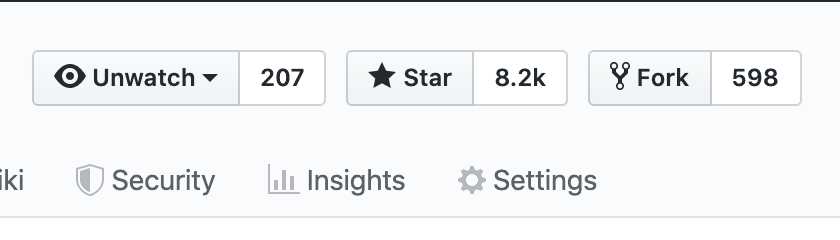

# Challenges

A set of tasks and challenge for nerds to train and get familiar with software challenges

## How to join?

- Fork the repo and give it a STAR 

- join our discussion groups

   

 

 
 

 ## How to submit your work?
 1- make a fork of this repo and give it a star

 2- update the main branch before starting any task

 3- create a new branch for each task. each feature branch should be pulled from the updated main branch

 4- make small commits for each new modification. each commit should contain only one or two files.

 5- you should follow the [contributing guide](https://github.com/its-dibo/its-dibo/blob/main/CONTRIBUTING.md)

 ## any questions?
 open a [discussion](/discussions) or report open an [issue]()

